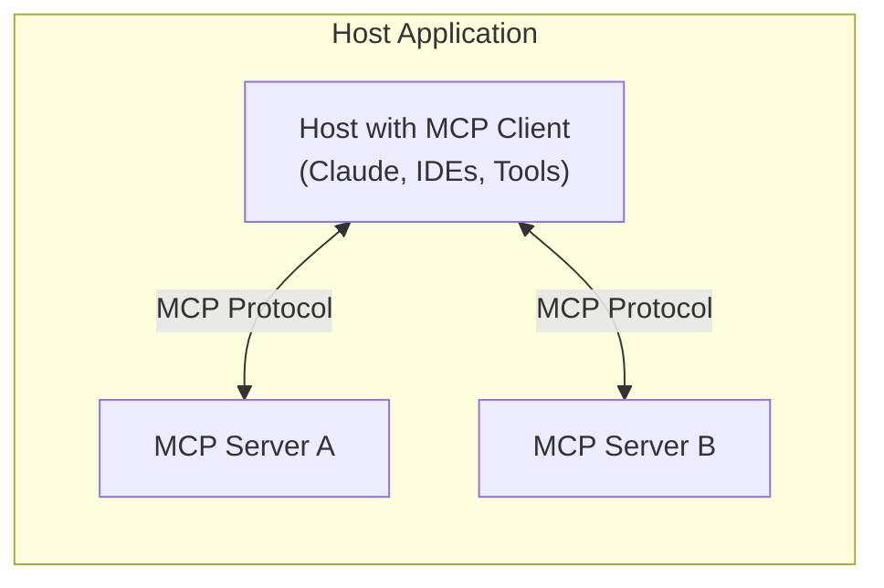

# Creating a TypeScript MCP Server

## Core Architecture

The Model Context Protocol (MCP) follows a client-host-server architecture:



### Key Components

1. **Host Applications**: Programs like Claude Desktop or IDEs that want to access data through MCP
2. **MCP Clients**: Protocol clients that maintain 1:1 connections with servers
3. **MCP Servers**: Lightweight programs exposing specific capabilities through the standardized protocol

### Core Features

MCP servers can provide three types of capabilities:

1. **Resources**: File-like data that can be read by clients
2. **Tools**: Functions that can be called by the LLM (with user approval)
3. **Prompts**: Pre-written templates for specific tasks

## Protocol Requirements

### 1. Message Format
- Uses JSON-RPC 2.0 for all communication
- Messages must include:
  - `jsonrpc`: Always "2.0"
  - `id`: Unique message identifier
  - `method`: The RPC method name
  - `params`: Method parameters (if any)

### 2. Transport Layer
- Must support bidirectional communication
- Must maintain message ordering
- Must handle connection lifecycle
- Supported transports:
  - stdio (standard)
  - HTTP+SSE
  - WebSocket (optional)

### 3. Security Requirements
- Tools represent arbitrary code execution
- Must obtain explicit user consent before tool invocation
- Must implement proper access controls
- Must validate all inputs
- Must handle sensitive data appropriately

## Development Prerequisites

1. **Required Knowledge**:
   - TypeScript/Node.js development
   - JSON-RPC 2.0 protocol
   - Async/await patterns
   - Error handling best practices

2. **Development Environment**:
   - Node.js 18+
   - TypeScript 4.7+
   - A code editor with TypeScript support

3. **Required Packages**:
   ```bash
   npm install @modelcontextprotocol/sdk
   ```

## Project Structure

```
my-mcp-server/
├── src/
│   ├── index.ts        # Entry point
│   ├── server.ts       # Server implementation
│   ├── transport.ts    # Transport layer
│   ├── tools/          # Tool implementations
│   ├── resources/      # Resource handlers
│   └── prompts/        # Prompt templates
├── package.json
└── tsconfig.json
```

I'll continue gathering more detailed information about each component before proceeding with the implementation details. Would you like me to focus on any particular aspect first?

## Protocol Communication

### Message Types

1. **Request Messages**
```typescript
interface RequestMessage {
    jsonrpc: "2.0";
    id: number | string;
    method: string;
    params?: unknown;
}
```

2. **Response Messages**
```typescript
interface ResponseMessage {
    jsonrpc: "2.0";
    id: number | string;
    result?: unknown;
    error?: {
        code: number;
        message: string;
        data?: unknown;
    };
}
```

3. **Notification Messages**
```typescript
interface NotificationMessage {
    jsonrpc: "2.0";
    method: string;
    params?: unknown;
}
```

### Protocol Methods

1. **Initialize**
```typescript
interface InitializeParams {
    protocolVersion: string;
    capabilities: {
        resources?: ResourcesClientCapabilities;
        tools?: ToolsClientCapabilities;
        prompts?: PromptsClientCapabilities;
    };
}
```

2. **Resource Methods**
```typescript
interface ListResourcesParams {
    roots?: string[];
}

interface ReadResourceParams {
    uri: string;
}
```

3. **Tool Methods**
```typescript
interface ListToolsParams {}

interface CallToolParams {
    name: string;
    arguments?: Record<string, unknown>;
}
```

4. **Prompt Methods**
```typescript
interface ListPromptsParams {}

interface GetPromptParams {
    name: string;
    arguments?: Record<string, unknown>;
}
```

### Protocol Flow

1. **Server Initialization**
```typescript
// 1. Client sends initialize request
{
    jsonrpc: "2.0",
    id: 1,
    method: "initialize",
    params: {
        protocolVersion: "0.1.0",
        capabilities: {
            resources: {},
            tools: {},
            prompts: {}
        }
    }
}

// 2. Server responds with capabilities
{
    jsonrpc: "2.0",
    id: 1,
    result: {
        serverInfo: {
            name: "example-server",
            version: "1.0.0"
        },
        capabilities: {
            resources: {
                roots: ["file:///", "https://"]
            },
            tools: {
                execution: true
            },
            prompts: {
                templates: true
            }
        }
    }
}

// 3. Client sends initialized notification
{
    jsonrpc: "2.0",
    method: "initialized"
}
```

2. **Resource Operations**
```typescript
// List resources request
{
    jsonrpc: "2.0",
    id: 2,
    method: "resources/list",
    params: {
        roots: ["file:///home/user/"]
    }
}

// Read resource request
{
    jsonrpc: "2.0",
    id: 3,
    method: "resources/read",
    params: {
        uri: "file:///home/user/example.txt"
    }
}
```

3. **Tool Operations**
```typescript
// List tools request
{
    jsonrpc: "2.0",
    id: 4,
    method: "tools/list"
}

// Call tool request
{
    jsonrpc: "2.0",
    id: 5,
    method: "tools/call",
    params: {
        name: "example_tool",
        arguments: {
            input: "test"
        }
    }
}
```

4. **Prompt Operations**
```typescript
// List prompts request
{
    jsonrpc: "2.0",
    id: 6,
    method: "prompts/list"
}

// Get prompt request
{
    jsonrpc: "2.0",
    id: 7,
    method: "prompts/get",
    params: {
        name: "example_prompt",
        arguments: {
            variable: "value"
        }
    }
}
```

### Progress Updates

Servers can send progress notifications during long-running operations:

```typescript
interface ProgressParams {
    progressToken: string;
    progress: number;
    total: number;
    message?: string;
}

// Progress notification
{
    jsonrpc: "2.0",
    method: "$/progress",
    params: {
        progressToken: "token-123",
        progress: 50,
        total: 100,
        message: "Processing..."
    }
}
```

### Error Handling

1. **Standard Error Codes**
```typescript
enum ErrorCodes {
    // JSON-RPC 2.0 Reserved Codes
    ParseError = -32700,
    InvalidRequest = -32600,
    MethodNotFound = -32601,
    InvalidParams = -32602,
    InternalError = -32603,

    // MCP Protocol Codes
    RequestCancelled = -32800,
    ContentModified = -32801,
    ServerNotInitialized = -32802,
    UnknownProtocolVersion = -32803
}
```

2. **Error Response Format**
```typescript
interface ErrorResponse {
    jsonrpc: "2.0",
    id: number | string,
    error: {
        code: number,
        message: string,
        data?: {
            retry?: boolean,
            details?: string
        }
    }
}
```

## Transport Layer Implementation

### Base Transport Interface

```typescript
interface Transport {
    onmessage?: (message: unknown) => void;
    onerror?: (error: Error) => void;
    onclose?: () => void;
    send(message: unknown): Promise<void>;
    close(): Promise<void>;
}
```

### 1. stdio Transport (Standard)

The stdio transport uses standard input/output streams for communication:

```typescript
import { createInterface } from 'readline';
import { Readable, Writable } from 'stream';

class StdioTransport implements Transport {
    private readline: ReturnType<typeof createInterface>;
    private writer: Writable;

    constructor(input: Readable = process.stdin, output: Writable = process.stdout) {
        this.readline = createInterface({ input });
        this.writer = output;

        this.readline.on('line', (line) => {
            try {
                const message = JSON.parse(line);
                this.onmessage?.(message);
            } catch (error) {
                this.onerror?.(new Error(`Failed to parse message: ${error}`));
            }
        });

        this.readline.on('close', () => {
            this.onclose?.();
        });
    }

    async send(message: unknown): Promise<void> {
        return new Promise((resolve, reject) => {
            const json = JSON.stringify(message);
            this.writer.write(json + '\n', (error) => {
                if (error) reject(error);
                else resolve();
            });
        });
    }

    async close(): Promise<void> {
        this.readline.close();
    }
}
```

### 2. HTTP+SSE Transport

The HTTP+SSE transport uses Server-Sent Events for server-to-client messages and HTTP POST for client-to-server messages:

```typescript
import express from 'express';
import { EventEmitter } from 'events';

class SSETransport implements Transport {
    private clients: Map<string, express.Response> = new Map();
    private events = new EventEmitter();

    constructor(private app: express.Application, private path: string) {
        // SSE endpoint for server-to-client messages
        this.app.get(this.path, (req, res) => {
            const clientId = req.query.clientId as string;

            res.setHeader('Content-Type', 'text/event-stream');
            res.setHeader('Cache-Control', 'no-cache');
            res.setHeader('Connection', 'keep-alive');

            this.clients.set(clientId, res);

            req.on('close', () => {
                this.clients.delete(clientId);
                this.onclose?.();
            });
        });

        // POST endpoint for client-to-server messages
        this.app.post(this.path, express.json(), (req, res) => {
            try {
                this.onmessage?.(req.body);
                res.sendStatus(200);
            } catch (error) {
                this.onerror?.(error as Error);
                res.sendStatus(500);
            }
        });
    }

    async send(message: unknown): Promise<void> {
        const data = `data: ${JSON.stringify(message)}\n\n`;
        for (const client of this.clients.values()) {
            client.write(data);
        }
    }

    async close(): Promise<void> {
        for (const client of this.clients.values()) {
            client.end();
        }
        this.clients.clear();
    }
}
```

### 3. WebSocket Transport (Optional)

```typescript
import WebSocket from 'ws';

class WebSocketTransport implements Transport {
    private wss: WebSocket.Server;
    private clients: Set<WebSocket> = new Set();

    constructor(port: number) {
        this.wss = new WebSocket.Server({ port });

        this.wss.on('connection', (ws) => {
            this.clients.add(ws);

            ws.on('message', (data) => {
                try {
                    const message = JSON.parse(data.toString());
                    this.onmessage?.(message);
                } catch (error) {
                    this.onerror?.(new Error(`Failed to parse message: ${error}`));
                }
            });

            ws.on('close', () => {
                this.clients.delete(ws);
                if (this.clients.size === 0) {
                    this.onclose?.();
                }
            });

            ws.on('error', (error) => {
                this.onerror?.(error);
            });
        });
    }

    async send(message: unknown): Promise<void> {
        const data = JSON.stringify(message);
        const promises = Array.from(this.clients).map(
            (client) => new Promise<void>((resolve, reject) => {
                client.send(data, (error) => {
                    if (error) reject(error);
                    else resolve();
                });
            })
        );
        await Promise.all(promises);
    }

    async close(): Promise<void> {
        for (const client of this.clients) {
            client.close();
        }
        this.clients.clear();
        await new Promise<void>((resolve) => this.wss.close(() => resolve()));
    }
}
```

## Server Initialization and Lifecycle

### Server Configuration

```typescript
interface ServerConfiguration {
    name: string;
    version: string;
    capabilities: {
        resources?: {
            roots?: string[];
            watch?: {
                dynamic?: boolean;
                filters?: string[];
            };
        };
        tools?: {
            execution: boolean;
            progress?: boolean;
            cancel?: boolean;
        };
        prompts?: {
            templates: boolean;
            arguments?: boolean;
        };
    };
}

### Server State Management

```typescript
enum ServerState {
    Created = 'created',
    Initializing = 'initializing',
    Ready = 'ready',
    Stopping = 'stopping',
    Stopped = 'stopped'
}

class ServerStateManager {
    private state: ServerState = ServerState.Created;
    private listeners: Set<(state: ServerState) => void> = new Set();

    getState(): ServerState {
        return this.state;
    }

    setState(newState: ServerState): void {
        this.state = newState;
        this.notifyListeners();
    }

    onStateChange(listener: (state: ServerState) => void): () => void {
        this.listeners.add(listener);
        return () => this.listeners.delete(listener);
    }

    private notifyListeners(): void {
        for (const listener of this.listeners) {
            listener(this.state);
        }
    }
}

### Server Lifecycle Events

```typescript
interface ServerLifecycleEvents {
    onInitialize?: (params: InitializeParams) => Promise<void>;
    onInitialized?: () => Promise<void>;
    onShutdown?: () => Promise<void>;
}

class LifecycleManager {
    private events: ServerLifecycleEvents;
    private stateManager: ServerStateManager;

    constructor(events: ServerLifecycleEvents, stateManager: ServerStateManager) {
        this.events = events;
        this.stateManager = stateManager;
    }

    async initialize(params: InitializeParams): Promise<void> {
        if (this.stateManager.getState() !== ServerState.Created) {
            throw new Error('Server already initialized');
        }

        this.stateManager.setState(ServerState.Initializing);

        try {
            await this.events.onInitialize?.(params);
            this.stateManager.setState(ServerState.Ready);
            await this.events.onInitialized?.();
        } catch (error) {
            this.stateManager.setState(ServerState.Stopped);
            throw error;
        }
    }

    async shutdown(): Promise<void> {
        if (this.stateManager.getState() === ServerState.Stopped) {
            return;
        }

        this.stateManager.setState(ServerState.Stopping);

        try {
            await this.events.onShutdown?.();
        } finally {
            this.stateManager.setState(ServerState.Stopped);
        }
    }
}

### Resource Cleanup

```typescript
interface CleanupHandler {
    cleanup(): Promise<void>;
}

class ResourceCleanup {
    private handlers: Set<CleanupHandler> = new Set();

    register(handler: CleanupHandler): void {
        this.handlers.add(handler);
    }

    unregister(handler: CleanupHandler): void {
        this.handlers.delete(handler);
    }

    async cleanupAll(): Promise<void> {
        const errors: Error[] = [];

        for (const handler of this.handlers) {
            try {
                await handler.cleanup();
            } catch (error) {
                errors.push(error instanceof Error ? error : new Error(String(error)));
            }
        }

        if (errors.length > 0) {
            throw new AggregateError(errors, 'Cleanup failed');
        }
    }
}

### Server Implementation

```typescript
class MCPServer {
    private config: ServerConfiguration;
    private stateManager: ServerStateManager;
    private lifecycleManager: LifecycleManager;
    private cleanup: ResourceCleanup;
    private transport: Transport;

    constructor(config: ServerConfiguration) {
        this.config = config;
        this.stateManager = new ServerStateManager();
        this.cleanup = new ResourceCleanup();

        this.lifecycleManager = new LifecycleManager({
            onInitialize: this.handleInitialize.bind(this),
            onInitialized: this.handleInitialized.bind(this),
            onShutdown: this.handleShutdown.bind(this)
        }, this.stateManager);
    }

    async start(transport: Transport): Promise<void> {
        this.transport = transport;

        // Register transport cleanup
        this.cleanup.register({
            cleanup: async () => {
                await this.transport.close();
            }
        });

        // Setup message handling
        this.transport.onmessage = this.handleMessage.bind(this);
        this.transport.onerror = this.handleError.bind(this);
        this.transport.onclose = this.handleClose.bind(this);
    }

    private async handleInitialize(params: InitializeParams): Promise<void> {
        // Verify protocol version compatibility
        if (!this.isCompatibleVersion(params.protocolVersion)) {
            throw new Error(`Unsupported protocol version: ${params.protocolVersion}`);
        }

        // Negotiate capabilities
        const negotiatedCapabilities = this.negotiateCapabilities(params.capabilities);

        // Send initialize result
        await this.transport.send({
            jsonrpc: '2.0',
            id: params.id,
            result: {
                serverInfo: {
                    name: this.config.name,
                    version: this.config.version
                },
                capabilities: negotiatedCapabilities
            }
        });
    }

    private async handleInitialized(): Promise<void> {
        // Server is now ready to handle requests
    }

    private async handleShutdown(): Promise<void> {
        await this.cleanup.cleanupAll();
    }

    private isCompatibleVersion(clientVersion: string): boolean {
        // Implement version compatibility check
        const [major, minor] = clientVersion.split('.').map(Number);
        return major === 0 && minor >= 1;
    }

    private negotiateCapabilities(clientCapabilities: ClientCapabilities): ServerCapabilities {
        // Implement capability negotiation
        return {
            resources: this.negotiateResourceCapabilities(clientCapabilities.resources),
            tools: this.negotiateToolCapabilities(clientCapabilities.tools),
            prompts: this.negotiatePromptCapabilities(clientCapabilities.prompts)
        };
    }
}
```

## Resource Implementation

### Resource Types and Interfaces

```typescript
interface Resource {
    uri: string;
    name: string;
    type: 'file' | 'directory';
    mimeType?: string;
    size?: number;
    modifiedTime?: string;
    metadata?: Record<string, unknown>;
}

interface ResourceContent {
    uri: string;
    content: string | Buffer;
    mimeType: string;
    metadata?: Record<string, unknown>;
}

interface ResourceRoot {
    uri: string;
    capabilities: {
        read: boolean;
        write?: boolean;
        delete?: boolean;
        watch?: boolean;
    };
}

### Resource Manager Implementation

```typescript
class ResourceManager {
    private roots: Map<string, ResourceRootHandler> = new Map();
    private watchers: Map<string, ResourceWatcher> = new Map();

    constructor(private capabilities: ResourcesServerCapabilities) {}

    registerRoot(uri: string, handler: ResourceRootHandler): void {
        this.roots.set(uri, handler);

        if (this.capabilities.watch?.dynamic) {
            this.setupWatcher(uri, handler);
        }
    }

    async listResources(params: ListResourcesParams): Promise<Resource[]> {
        const resources: Resource[] = [];
        const targetRoots = params.roots || Array.from(this.roots.keys());

        for (const rootUri of targetRoots) {
            const handler = this.roots.get(rootUri);
            if (!handler) continue;

            const rootResources = await handler.list();
            resources.push(...rootResources);
        }

        return resources;
    }

    async readResource(params: ReadResourceParams): Promise<ResourceContent> {
        const { uri } = params;
        const root = this.findRootForUri(uri);

        if (!root) {
            throw new Error(`No root found for URI: ${uri}`);
        }

        return root.read(uri);
    }

    private findRootForUri(uri: string): ResourceRootHandler | undefined {
        for (const [rootUri, handler] of this.roots) {
            if (uri.startsWith(rootUri)) {
                return handler;
            }
        }
        return undefined;
    }

    private setupWatcher(uri: string, handler: ResourceRootHandler): void {
        if (!handler.watch) return;

        const watcher = new ResourceWatcher(uri, handler, {
            filters: this.capabilities.watch?.filters
        });

        this.watchers.set(uri, watcher);
    }
}

### Resource Root Handler

```typescript
interface ResourceRootHandler {
    list(): Promise<Resource[]>;
    read(uri: string): Promise<ResourceContent>;
    watch?(onChange: (changes: ResourceChange[]) => void): void;
}

class FileSystemRootHandler implements ResourceRootHandler {
    constructor(
        private rootPath: string,
        private options: {
            allowedExtensions?: string[];
            maxFileSize?: number;
        } = {}
    ) {}

    async list(): Promise<Resource[]> {
        const resources: Resource[] = [];
        await this.walkDirectory(this.rootPath, resources);
        return resources;
    }

    async read(uri: string): Promise<ResourceContent> {
        const filePath = this.uriToPath(uri);

        // Validate path is within root
        if (!filePath.startsWith(this.rootPath)) {
            throw new Error('Access denied: Path outside root');
        }

        const stats = await fs.promises.stat(filePath);

        // Check file size
        if (
            this.options.maxFileSize &&
            stats.size > this.options.maxFileSize
        ) {
            throw new Error('File too large');
        }

        const content = await fs.promises.readFile(filePath);
        const mimeType = this.getMimeType(filePath);

        return {
            uri,
            content,
            mimeType
        };
    }

    watch(onChange: (changes: ResourceChange[]) => void): void {
        const watcher = fs.watch(
            this.rootPath,
            { recursive: true },
            (eventType, filename) => {
                if (!filename) return;

                const uri = this.pathToUri(path.join(this.rootPath, filename));
                onChange([{
                    uri,
                    type: eventType === 'rename' ? 'deleted' : 'modified'
                }]);
            }
        );

        // Cleanup on process exit
        process.on('exit', () => watcher.close());
    }

    private async walkDirectory(
        dirPath: string,
        resources: Resource[]
    ): Promise<void> {
        const entries = await fs.promises.readdir(dirPath, { withFileTypes: true });

        for (const entry of entries) {
            const fullPath = path.join(dirPath, entry.name);
            const uri = this.pathToUri(fullPath);

            if (entry.isDirectory()) {
                resources.push({
                    uri,
                    name: entry.name,
                    type: 'directory'
                });
                await this.walkDirectory(fullPath, resources);
            } else if (entry.isFile()) {
                // Check file extension
                if (
                    this.options.allowedExtensions &&
                    !this.options.allowedExtensions.some(ext =>
                        entry.name.endsWith(ext)
                    )
                ) {
                    continue;
                }

                const stats = await fs.promises.stat(fullPath);
                resources.push({
                    uri,
                    name: entry.name,
                    type: 'file',
                    mimeType: this.getMimeType(entry.name),
                    size: stats.size,
                    modifiedTime: stats.mtime.toISOString()
                });
            }
        }
    }

    private pathToUri(filePath: string): string {
        return `file://${filePath}`;
    }

    private uriToPath(uri: string): string {
        return uri.replace('file://', '');
    }

    private getMimeType(filePath: string): string {
        const extension = path.extname(filePath).toLowerCase();
        const mimeTypes: Record<string, string> = {
            '.txt': 'text/plain',
            '.json': 'application/json',
            '.js': 'application/javascript',
            '.ts': 'application/typescript',
            '.html': 'text/html',
            '.css': 'text/css',
            '.png': 'image/png',
            '.jpg': 'image/jpeg',
            '.jpeg': 'image/jpeg',
            '.gif': 'image/gif',
            '.svg': 'image/svg+xml',
            '.pdf': 'application/pdf'
        };
        return mimeTypes[extension] || 'application/octet-stream';
    }
}

### Resource Change Notifications

```typescript
type ResourceChangeType = 'created' | 'modified' | 'deleted';

interface ResourceChange {
    uri: string;
    type: ResourceChangeType;
}

class ResourceWatcher {
    private handler: ResourceRootHandler;
    private filters?: string[];

    constructor(
        private rootUri: string,
        handler: ResourceRootHandler,
        options: {
            filters?: string[];
        } = {}
    ) {
        this.handler = handler;
        this.filters = options.filters;

        if (handler.watch) {
            handler.watch(this.handleChanges.bind(this));
        }
    }

    private handleChanges(changes: ResourceChange[]): void {
        // Filter changes based on patterns
        const filteredChanges = this.filters
            ? changes.filter(change =>
                this.filters!.some(pattern =>
                    minimatch(change.uri, pattern)
                )
            )
            : changes;

        if (filteredChanges.length > 0) {
            // Notify clients about changes
            this.notifyChanges(filteredChanges);
        }
    }

    private notifyChanges(changes: ResourceChange[]): void {
        // Implementation depends on how notifications are sent to clients
        // This could be through WebSocket, Server-Sent Events, or other mechanisms
        console.log('Resource changes:', changes);
    }
}
```

## Tool Implementation

### Tool Types

```typescript
interface Tool {
    name: string;
    description: string;
    schema: {
        type: 'object';
        properties: Record<string, JSONSchema>;
        required?: string[];
    };
}

interface ToolResult {
    content: Array<{
        type: 'text' | 'base64';
        text?: string;
        base64?: string;
        mimeType?: string;
    }>;
    metadata?: Record<string, unknown>;
}

interface ToolProgress {
    progress: number;
    total: number;
    message?: string;
}

### Tool Manager Implementation

```typescript
class ToolManager {
    private tools: Map<string, ToolImplementation> = new Map();
    private activeExecutions: Map<string, AbortController> = new Map();

    constructor(private capabilities: ToolsServerCapabilities) {}

    registerTool(implementation: ToolImplementation): void {
        this.tools.set(implementation.name, implementation);
    }

    async listTools(): Promise<Tool[]> {
        return Array.from(this.tools.values()).map(tool => ({
            name: tool.name,
            description: tool.description,
            schema: tool.schema
        }));
    }

    async executeTool(
        params: ExecuteToolParams,
        onProgress?: (progress: ToolProgress) => void
    ): Promise<ToolResult> {
        const { name, arguments: args } = params;
        const tool = this.tools.get(name);

        if (!tool) {
            throw new Error(`Tool not found: ${name}`);
        }

        // Validate arguments against schema
        this.validateArguments(args, tool.schema);

        // Create abort controller for this execution
        const abortController = new AbortController();
        const executionId = crypto.randomUUID();
        this.activeExecutions.set(executionId, abortController);

        try {
            // Execute tool with progress reporting and cancellation
            const result = await tool.execute(
                args,
                {
                    signal: abortController.signal,
                    onProgress
                }
            );

            return result;
        } finally {
            this.activeExecutions.delete(executionId);
        }
    }

    cancelExecution(executionId: string): void {
        const controller = this.activeExecutions.get(executionId);
        if (controller) {
            controller.abort();
            this.activeExecutions.delete(executionId);
        }
    }

    private validateArguments(
        args: unknown,
        schema: Tool['schema']
    ): void {
        const validator = new JSONSchemaValidator();
        if (!validator.validate(args, schema)) {
            throw new Error(
                `Invalid arguments: ${validator.getErrors().join(', ')}`
            );
        }
    }
}

### Tool Implementation Interface

```typescript
interface ToolImplementation extends Tool {
    execute(
        args: Record<string, unknown>,
        context: {
            signal: AbortSignal;
            onProgress?: (progress: ToolProgress) => void;
        }
    ): Promise<ToolResult>;
}

### Example Tool Implementations

```typescript
class FileSearchTool implements ToolImplementation {
    name = 'file_search';
    description = 'Search for files matching a pattern';
    schema = {
        type: 'object',
        properties: {
            pattern: {
                type: 'string',
                description: 'Glob pattern to match files'
            },
            directory: {
                type: 'string',
                description: 'Directory to search in'
            }
        },
        required: ['pattern', 'directory']
    };

    async execute(
        args: Record<string, unknown>,
        context: {
            signal: AbortSignal;
            onProgress?: (progress: ToolProgress) => void;
        }
    ): Promise<ToolResult> {
        const { pattern, directory } = args as {
            pattern: string;
            directory: string;
        };

        const files: string[] = [];
        let processed = 0;
        let total = 0;

        // Walk directory and find matches
        await this.walkDirectory(
            directory,
            pattern,
            files,
            (current, max) => {
                processed = current;
                total = max;
                context.onProgress?.({
                    progress: processed,
                    total,
                    message: `Processed ${processed} of ${total} files`
                });
            },
            context.signal
        );

        return {
            content: [{
                type: 'text',
                text: JSON.stringify(files, null, 2),
                mimeType: 'application/json'
            }],
            metadata: {
                totalFiles: total,
                matchedFiles: files.length
            }
        };
    }

    private async walkDirectory(
        dir: string,
        pattern: string,
        matches: string[],
        progress: (current: number, total: number) => void,
        signal: AbortSignal
    ): Promise<void> {
        if (signal.aborted) {
            throw new Error('Operation cancelled');
        }

        const entries = await fs.promises.readdir(dir, { withFileTypes: true });
        progress(0, entries.length);

        for (let i = 0; i < entries.length; i++) {
            if (signal.aborted) {
                throw new Error('Operation cancelled');
            }

            const entry = entries[i];
            const fullPath = path.join(dir, entry.name);

            if (entry.isDirectory()) {
                await this.walkDirectory(
                    fullPath,
                    pattern,
                    matches,
                    progress,
                    signal
                );
            } else if (entry.isFile() && minimatch(entry.name, pattern)) {
                matches.push(fullPath);
            }

            progress(i + 1, entries.length);
        }
    }
}

class ImageProcessingTool implements ToolImplementation {
    name = 'image_process';
    description = 'Process an image with various operations';
    schema = {
        type: 'object',
        properties: {
            operation: {
                type: 'string',
                enum: ['resize', 'rotate', 'grayscale']
            },
            input: {
                type: 'string',
                format: 'base64'
            },
            options: {
                type: 'object',
                properties: {
                    width: { type: 'number' },
                    height: { type: 'number' },
                    angle: { type: 'number' }
                }
            }
        },
        required: ['operation', 'input']
    };

    async execute(
        args: Record<string, unknown>,
        context: {
            signal: AbortSignal;
            onProgress?: (progress: ToolProgress) => void;
        }
    ): Promise<ToolResult> {
        const { operation, input, options } = args as {
            operation: string;
            input: string;
            options?: Record<string, number>;
        };

        // Report start of processing
        context.onProgress?.({
            progress: 0,
            total: 100,
            message: 'Starting image processing'
        });

        // Process image
        const result = await this.processImage(
            operation,
            input,
            options,
            progress => {
                context.onProgress?.({
                    progress,
                    total: 100,
                    message: `Processing image: ${progress}%`
                });
            },
            context.signal
        );

        return {
            content: [{
                type: 'base64',
                base64: result,
                mimeType: 'image/png'
            }]
        };
    }

    private async processImage(
        operation: string,
        input: string,
        options: Record<string, number> | undefined,
        onProgress: (progress: number) => void,
        signal: AbortSignal
    ): Promise<string> {
        // Simulate image processing with progress updates
        let progress = 0;
        const total = 100;
        const increment = 10;

        while (progress < total) {
            if (signal.aborted) {
                throw new Error('Operation cancelled');
            }

            await new Promise(resolve => setTimeout(resolve, 100));
            progress += increment;
            onProgress(progress);
        }

        // Return processed image (simulated)
        return input;
    }
}
```

### Progress Reporting in Tools

```typescript
class LongRunningTool implements ToolImplementation {
    name = 'long_running_tool';
    description = 'A tool that demonstrates progress reporting';
    schema = {
        type: 'object',
        properties: {
            steps: { type: 'number' }
        },
        required: ['steps']
    };

    async execute(
        args: Record<string, unknown>,
        progress?: (progress: number, total: number, message?: string) => void
    ): Promise<ToolResult> {
        const steps = Number(args.steps);

        for (let i = 0; i < steps; i++) {
            await new Promise(resolve => setTimeout(resolve, 1000));

            if (progress) {
                progress(i + 1, steps, `Processing step ${i + 1} of ${steps}`);
            }
        }

        return {
            content: [{
                type: 'text',
                text: `Completed ${steps} steps`
            }]
        };
    }
}
```

### Tool Error Handling

```typescript
class ToolError extends Error {
    constructor(
        message: string,
        public code: number = ErrorCodes.InternalError,
        public data?: unknown
    ) {
        super(message);
        this.name = 'ToolError';
    }
}

class SafeTool implements ToolImplementation {
    name = 'safe_tool';
    description = 'A tool that demonstrates proper error handling';
    schema = {
        type: 'object',
        properties: {
            input: { type: 'string' }
        },
        required: ['input']
    };

    async execute(args: Record<string, unknown>): Promise<ToolResult> {
        try {
            // Validate input
            const input = String(args.input);
            if (input.length === 0) {
                throw new ToolError(
                    'Input cannot be empty',
                    ErrorCodes.InvalidParams
                );
            }

            // Process input
            const result = await this.processInput(input);

            // Validate output
            if (!this.isValidOutput(result)) {
                throw new ToolError(
                    'Invalid tool output',
                    ErrorCodes.InternalError
                );
            }

            return {
                content: [{
                    type: 'text',
                    text: result
                }]
            };
        } catch (error) {
            // Convert unknown errors to ToolError
            if (!(error instanceof ToolError)) {
                throw new ToolError(
                    'Tool execution failed',
                    ErrorCodes.InternalError,
                    { originalError: error }
                );
            }
            throw error;
        }
    }

    private async processInput(input: string): Promise<string> {
        // Implement actual processing logic
        return `Processed: ${input}`;
    }

    private isValidOutput(output: string): boolean {
        return typeof output === 'string' && output.length > 0;
    }
}
```

## Prompt Implementation

### Prompt Types

```typescript
interface Prompt {
    name: string;
    description: string;
    schema?: {
        type: 'object';
        properties: Record<string, JSONSchema>;
        required?: string[];
    };
}

interface Message {
    role: 'system' | 'user' | 'assistant';
    content: string;
    name?: string;
}

interface PromptResult {
    messages: Message[];
    metadata?: Record<string, unknown>;
}

### Prompt Manager Implementation

```typescript
class PromptManager {
    private prompts: Map<string, PromptImplementation> = new Map();

    constructor(private capabilities: PromptsServerCapabilities) {}

    registerPrompt(implementation: PromptImplementation): void {
        this.prompts.set(implementation.name, implementation);
    }

    async listPrompts(): Promise<Prompt[]> {
        return Array.from(this.prompts.values()).map(prompt => ({
            name: prompt.name,
            description: prompt.description,
            schema: prompt.schema
        }));
    }

    async generatePrompt(
        params: GeneratePromptParams
    ): Promise<PromptResult> {
        const { name, arguments: args } = params;
        const prompt = this.prompts.get(name);

        if (!prompt) {
            throw new Error(`Prompt not found: ${name}`);
        }

        // Validate arguments if schema is provided
        if (prompt.schema && args) {
            this.validateArguments(args, prompt.schema);
        }

        return prompt.generate(args);
    }

    private validateArguments(
        args: unknown,
        schema: NonNullable<Prompt['schema']>
    ): void {
        const validator = new JSONSchemaValidator();
        if (!validator.validate(args, schema)) {
            throw new Error(
                `Invalid arguments: ${validator.getErrors().join(', ')}`
            );
        }
    }
}

### Prompt Implementation Interface

```typescript
interface PromptImplementation extends Prompt {
    generate(args?: Record<string, unknown>): Promise<PromptResult>;
}

### Example Prompt Implementations

```typescript
class TaskPrompt implements PromptImplementation {
    name = 'task_prompt';
    description = 'Generate a prompt for task completion';
    schema = {
        type: 'object',
        properties: {
            task: {
                type: 'string',
                description: 'The task to be completed'
            },
            context: {
                type: 'string',
                description: 'Additional context for the task'
            },
            language: {
                type: 'string',
                description: 'Preferred programming language'
            }
        },
        required: ['task']
    };

    async generate(args?: Record<string, unknown>): Promise<PromptResult> {
        const { task, context, language } = args as {
            task: string;
            context?: string;
            language?: string;
        };

        const messages: Message[] = [
            {
                role: 'system',
                content: 'You are a helpful programming assistant.'
            },
            {
                role: 'user',
                content: this.formatTask(task, context, language)
            }
        ];

        return {
            messages,
            metadata: {
                taskType: this.categorizeTask(task),
                language: language || 'any'
            }
        };
    }

    private formatTask(
        task: string,
        context?: string,
        language?: string
    ): string {
        let prompt = `Task: ${task}\n\n`;

        if (context) {
            prompt += `Context: ${context}\n\n`;
        }

        if (language) {
            prompt += `Please provide a solution in ${language}.\n\n`;
        }

        prompt += 'Please help me complete this task.';
        return prompt;
    }

    private categorizeTask(task: string): string {
        // Simple task categorization logic
        if (task.toLowerCase().includes('debug')) return 'debugging';
        if (task.toLowerCase().includes('implement')) return 'implementation';
        if (task.toLowerCase().includes('test')) return 'testing';
        return 'general';
    }
}

class ConversationPrompt implements PromptImplementation {
    name = 'conversation_prompt';
    description = 'Generate a prompt for conversation continuation';
    schema = {
        type: 'object',
        properties: {
            history: {
                type: 'array',
                items: {
                    type: 'object',
                    properties: {
                        role: {
                            type: 'string',
                            enum: ['user', 'assistant']
                        },
                        content: {
                            type: 'string'
                        }
                    },
                    required: ['role', 'content']
                }
            },
            context: {
                type: 'string'
            },
            persona: {
                type: 'string'
            }
        },
        required: ['history']
    };

    async generate(args?: Record<string, unknown>): Promise<PromptResult> {
        const { history, context, persona } = args as {
            history: Array<{ role: 'user' | 'assistant'; content: string }>;
            context?: string;
            persona?: string;
        };

        const messages: Message[] = [
            {
                role: 'system',
                content: this.generateSystemPrompt(persona)
            }
        ];

        if (context) {
            messages.push({
                role: 'system',
                content: `Context: ${context}`
            });
        }

        // Add conversation history
        messages.push(
            ...history.map(entry => ({
                role: entry.role,
                content: entry.content
            }))
        );

        return {
            messages,
            metadata: {
                turnCount: history.length,
                persona: persona || 'default'
            }
        };
    }

    private generateSystemPrompt(persona?: string): string {
        switch (persona?.toLowerCase()) {
            case 'teacher':
                return 'You are a patient and knowledgeable teacher.';
            case 'expert':
                return 'You are an expert programmer with deep technical knowledge.';
            case 'mentor':
                return 'You are a supportive programming mentor.';
            default:
                return 'You are a helpful programming assistant.';
        }
    }
}

class CodeReviewPrompt implements PromptImplementation {
    name = 'code_review_prompt';
    description = 'Generate a prompt for code review';
    schema = {
        type: 'object',
        properties: {
            code: {
                type: 'string',
                description: 'The code to be reviewed'
            },
            language: {
                type: 'string',
                description: 'Programming language of the code'
            },
            focus: {
                type: 'array',
                items: {
                    type: 'string',
                    enum: [
                        'security',
                        'performance',
                        'maintainability',
                        'style',
                        'bugs'
                    ]
                }
            }
        },
        required: ['code']
    };

    async generate(args?: Record<string, unknown>): Promise<PromptResult> {
        const { code, language, focus } = args as {
            code: string;
            language?: string;
            focus?: string[];
        };

        const messages: Message[] = [
            {
                role: 'system',
                content: this.generateSystemPrompt(language, focus)
            },
            {
                role: 'user',
                content: `Please review the following code:\n\n\`\`\`${
                    language || ''
                }\n${code}\n\`\`\``
            }
        ];

        return {
            messages,
            metadata: {
                language: language || 'unknown',
                focusAreas: focus || ['general'],
                codeLength: code.length
            }
        };
    }

    private generateSystemPrompt(
        language?: string,
        focus?: string[]
    ): string {
        let prompt = 'You are an experienced code reviewer. ';

        if (language) {
            prompt += `You specialize in ${language} development. `;
        }

        if (focus && focus.length > 0) {
            prompt += `Please focus on the following aspects: ${focus.join(
                ', '
            )}. `;
        }

        prompt += 'Provide constructive feedback and suggestions for improvement.';
        return prompt;
    }
}
```

## LangChain Integration

### Converting MCP Servers to LangChain Tools

```typescript
import { DynamicStructuredTool } from '@langchain/core/tools';
import { convertMCPServersToLangChainTools } from '@h1deya/mcp-langchain-tools';

// MCP server configuration
const mcpServers = {
    filesystem: {
        command: 'npx',
        args: ['-y', '@modelcontextprotocol/server-filesystem', '/path/to/directory']
    },
    fetch: {
        command: 'npx',
        args: ['-y', '@modelcontextprotocol/server-fetch']
    }
};

// Convert MCP servers to LangChain tools
const { tools, cleanup } = await convertMCPServersToLangChainTools(mcpServers);

try {
    // Use the tools with LangChain
    for (const tool of tools) {
        console.log(`Tool: ${tool.name}`);
        console.log(`Description: ${tool.description}`);
        console.log(`Schema: ${JSON.stringify(tool.schema, null, 2)}`);
    }
} finally {
    // Clean up MCP servers
    await cleanup();
}
```

### Using MCP Tools with LangChain Agents

```typescript
import { ChatOpenAI } from '@langchain/openai';
import { createReactAgent } from '@langchain/langgraph/prebuilt';

// Initialize the LLM
const llm = new ChatOpenAI({
    modelName: 'gpt-4',
    temperature: 0
});

// Create the agent
const agent = createReactAgent({
    llm,
    tools,
    // Optional: Add memory or other configurations
});

// Use the agent
const result = await agent.invoke({
    input: 'Read the contents of example.txt and summarize it'
});

console.log(result);
```

### Implementing Custom MCP Tools for LangChain

```typescript
class CustomMCPTool implements ToolImplementation {
    name = 'custom_tool';
    description = 'A custom tool that works with LangChain';
    schema = {
        type: 'object',
        properties: {
            query: { type: 'string' }
        },
        required: ['query']
    };

    async execute(args: Record<string, unknown>): Promise<ToolResult> {
        const query = String(args.query);

        // Implement custom logic
        const result = await this.processQuery(query);

        return {
            content: [{
                type: 'text',
                text: result
            }]
        };
    }

    private async processQuery(query: string): Promise<string> {
        // Implement processing logic that works well with LangChain
        return `Processed query: ${query}`;
    }
}

// Register the tool with your MCP server
const toolManager = new ToolManager({ execution: true });
toolManager.registerTool('custom_tool', new CustomMCPTool());
```

### Error Handling in LangChain Integration

```typescript
class LangChainCompatibleError extends ToolError {
    constructor(message: string, code: number = ErrorCodes.InternalError) {
        super(message, code);

        // Ensure error format is compatible with LangChain expectations
        this.message = JSON.stringify({
            error: message,
            code,
            toolName: this.name
        });
    }
}

class LangChainTool implements ToolImplementation {
    name = 'langchain_tool';
    description = 'A tool designed for LangChain compatibility';
    schema = {
        type: 'object',
        properties: {
            input: { type: 'string' }
        },
        required: ['input']
    };

    async execute(args: Record<string, unknown>): Promise<ToolResult> {
        try {
            const input = String(args.input);

            // Validate input in a LangChain-friendly way
            if (!this.isValidInput(input)) {
                throw new LangChainCompatibleError(
                    'Invalid input format',
                    ErrorCodes.InvalidParams
                );
            }

            // Process the input
            const result = await this.process(input);

            return {
                content: [{
                    type: 'text',
                    text: result
                }]
            };
        } catch (error) {
            // Ensure all errors are in LangChain-compatible format
            if (!(error instanceof LangChainCompatibleError)) {
                throw new LangChainCompatibleError(
                    'Tool execution failed',
                    ErrorCodes.InternalError
                );
            }
            throw error;
        }
    }

    private isValidInput(input: string): boolean {
        // Implement input validation
        return input.length > 0;
    }

    private async process(input: string): Promise<string> {
        // Implement processing logic
        return `Processed for LangChain: ${input}`;
    }
}
```

## Security Implementation

### Authentication

```typescript
interface AuthenticationProvider {
    authenticate(token: string): Promise<AuthContext>;
    validateToken(token: string): Promise<boolean>;
}

interface AuthContext {
    userId: string;
    permissions: string[];
    metadata?: Record<string, unknown>;
}

class TokenAuthProvider implements AuthenticationProvider {
    private tokens: Map<string, AuthContext> = new Map();

    async authenticate(token: string): Promise<AuthContext> {
        const context = this.tokens.get(token);

        if (!context) {
            throw new MCPError(
                'Invalid authentication token',
                ErrorCode.ResourceAccessDenied
            );
        }

        return context;
    }

    async validateToken(token: string): Promise<boolean> {
        return this.tokens.has(token);
    }

    registerToken(token: string, context: AuthContext): void {
        this.tokens.set(token, context);
    }
}

### Authorization

```typescript
interface AuthorizationProvider {
    authorize(
        context: AuthContext,
        resource: string,
        action: string
    ): Promise<boolean>;
}

class PermissionBasedAuthorization implements AuthorizationProvider {
    async authorize(
        context: AuthContext,
        resource: string,
        action: string
    ): Promise<boolean> {
        const requiredPermission = `${resource}:${action}`;
        return context.permissions.includes(requiredPermission);
    }
}

### Security Manager

```typescript
class SecurityManager {
    constructor(
        private authentication: AuthenticationProvider,
        private authorization: AuthorizationProvider
    ) {}

    async authenticateRequest(
        request: RequestMessage
    ): Promise<AuthContext> {
        const token = this.extractToken(request);

        if (!token) {
            throw new MCPError(
                'Missing authentication token',
                ErrorCode.ResourceAccessDenied
            );
        }

        return this.authentication.authenticate(token);
    }

    async authorizeOperation(
        context: AuthContext,
        resource: string,
        action: string
    ): Promise<void> {
        const isAuthorized = await this.authorization.authorize(
            context,
            resource,
            action
        );

        if (!isAuthorized) {
            throw new MCPError(
                'Operation not authorized',
                ErrorCode.ResourceAccessDenied,
                { resource, action }
            );
        }
    }

    private extractToken(request: RequestMessage): string | undefined {
        return (request.params as Record<string, unknown>)?.token as string;
    }
}

### Secure Server Implementation

```typescript
class SecureMCPServer extends MCPServer {
    private securityManager: SecurityManager;

    constructor(
        config: ServerConfiguration,
        authentication: AuthenticationProvider,
        authorization: AuthorizationProvider
    ) {
        super(config);
        this.securityManager = new SecurityManager(
            authentication,
            authorization
        );
    }

    protected async handleRequest(
        request: RequestMessage
    ): Promise<ResponseMessage> {
        try {
            // Authenticate request
            const context = await this.securityManager.authenticateRequest(
                request
            );

            // Authorize operation
            const [resource, action] = this.parseMethod(request.method);
            await this.securityManager.authorizeOperation(
                context,
                resource,
                action
            );

            // Process authorized request
            return super.handleRequest(request);
        } catch (error) {
            return this.createErrorResponse(request.id, error);
        }
    }

    private parseMethod(method: string): [string, string] {
        const [resource, action] = method.split('/');
        return [resource, action];
    }
}

### Rate Limiting

```typescript
interface RateLimiter {
    checkLimit(key: string): Promise<void>;
    recordAccess(key: string): Promise<void>;
}

class TokenBucketRateLimiter implements RateLimiter {
    private buckets: Map<string, {
        tokens: number;
        lastRefill: number;
    }> = new Map();

    constructor(
        private maxTokens: number,
        private refillRate: number,
        private refillInterval: number
    ) {}

    async checkLimit(key: string): Promise<void> {
        const bucket = this.getBucket(key);
        this.refillBucket(bucket);

        if (bucket.tokens < 1) {
            throw new MCPError(
                'Rate limit exceeded',
                ErrorCode.ResourceLimitExceeded,
                { key }
            );
        }
    }

    async recordAccess(key: string): Promise<void> {
        const bucket = this.getBucket(key);
        bucket.tokens--;
    }

    private getBucket(key: string) {
        let bucket = this.buckets.get(key);

        if (!bucket) {
            bucket = {
                tokens: this.maxTokens,
                lastRefill: Date.now()
            };
            this.buckets.set(key, bucket);
        }

        return bucket;
    }

    private refillBucket(bucket: {
        tokens: number;
        lastRefill: number;
    }): void {
        const now = Date.now();
        const timePassed = now - bucket.lastRefill;
        const tokensToAdd = Math.floor(
            (timePassed / this.refillInterval) * this.refillRate
        );

        if (tokensToAdd > 0) {
            bucket.tokens = Math.min(
                this.maxTokens,
                bucket.tokens + tokensToAdd
            );
            bucket.lastRefill = now;
        }
    }
}

### Request Sanitization

```typescript
class RequestSanitizer {
    private inputSanitizer = new InputSanitizer();
    private uriValidator = new URIValidator();

    sanitizeRequest(request: RequestMessage): RequestMessage {
        return {
            jsonrpc: request.jsonrpc,
            id: request.id,
            method: this.inputSanitizer.sanitizeString(request.method),
            params: this.sanitizeParams(request.params)
        };
    }

    private sanitizeParams(
        params: unknown
    ): Record<string, unknown> | undefined {
        if (!params || typeof params !== 'object') {
            return undefined;
        }

        const sanitized: Record<string, unknown> = {};

        for (const [key, value] of Object.entries(params)) {
            sanitized[this.inputSanitizer.sanitizeString(key)] =
                this.sanitizeValue(value);
        }

        return sanitized;
    }

    private sanitizeValue(value: unknown): unknown {
        if (typeof value === 'string') {
            if (this.isURI(value)) {
                this.uriValidator.validateURI(value);
                return this.inputSanitizer.sanitizeURI(value);
            }
            return this.inputSanitizer.sanitizeString(value);
        }

        if (Array.isArray(value)) {
            return value.map(item => this.sanitizeValue(item));
        }

        if (typeof value === 'object' && value !== null) {
            return this.sanitizeParams(value);
        }

        return value;
    }

    private isURI(value: string): boolean {
        try {
            new URL(value);
            return true;
        } catch {
            return false;
        }
    }
}

### Secure Transport Layer

```typescript
class SecureTransport implements Transport {
    constructor(
        private transport: Transport,
        private encryption: {
            encrypt(data: string): Promise<string>;
            decrypt(data: string): Promise<string>;
        }
    ) {}

    async send(message: unknown): Promise<void> {
        const encrypted = await this.encryption.encrypt(
            JSON.stringify(message)
        );
        await this.transport.send(encrypted);
    }

    onmessage?: (message: unknown) => void;
    onerror?: (error: Error) => void;
    onclose?: () => void;

    async start(): Promise<void> {
        this.transport.onmessage = async (data: unknown) => {
            if (typeof data !== 'string') {
                this.onerror?.(
                    new Error('Invalid encrypted message format')
                );
                return;
            }

            try {
                const decrypted = await this.encryption.decrypt(data);
                const message = JSON.parse(decrypted);
                this.onmessage?.(message);
            } catch (error) {
                this.onerror?.(
                    new Error('Failed to decrypt message')
                );
            }
        };

        this.transport.onerror = this.onerror;
        this.transport.onclose = this.onclose;
    }

    async close(): Promise<void> {
        await this.transport.close();
    }
}
```

## Testing Strategies

### Unit Testing

```typescript
import { expect } from 'chai';
import { mock, instance, when, verify } from 'ts-mockito';

describe('MCPServer', () => {
    let server: MCPServer;
    let transport: Transport;

    beforeEach(() => {
        transport = mock<Transport>();
        server = new MCPServer({
            resources: {},
            tools: {},
            prompts: {}
        });
    });

    describe('initialization', () => {
        it('should handle initialize request', async () => {
            // Arrange
            const request = {
                jsonrpc: '2.0',
                id: 1,
                method: 'initialize',
                params: {
                    protocolVersion: '0.1.0',
                    capabilities: {}
                }
            };

            // Act
            const response = await server.handleRequest(request);

            // Assert
            expect(response).to.have.property('serverInfo');
            expect(response).to.have.property('capabilities');
        });
    });

    describe('resource handling', () => {
        it('should list resources', async () => {
            // Arrange
            const request = {
                jsonrpc: '2.0',
                id: 2,
                method: 'resources/list',
                params: {}
            };

            // Act
            const response = await server.handleRequest(request);

            // Assert
            expect(response).to.have.property('resources');
            expect(response.resources).to.be.an('array');
        });
    });
});
```

### Integration Testing

```typescript
describe('MCP Integration', () => {
    let server: MCPServer;
    let client: MCPClient;

    beforeEach(async () => {
        // Set up test environment
        const { server: testServer, client: testClient } = await setupTestEnvironment();
        server = testServer;
        client = testClient;
    });

    afterEach(async () => {
        // Clean up test environment
        await server.shutdown();
        await client.disconnect();
    });

    it('should handle complete workflow', async () => {
        // 1. Initialize connection
        await client.initialize();

        // 2. List resources
        const resources = await client.listResources();
        expect(resources).to.be.an('array');

        // 3. Read resource
        const content = await client.readResource(resources[0].uri);
        expect(content).to.have.property('text');

        // 4. Execute tool
        const result = await client.callTool('example_tool', { input: 'test' });
        expect(result).to.have.property('content');

        // 5. Get prompt
        const prompt = await client.getPrompt('example_prompt', { context: 'test' });
        expect(prompt).to.have.property('messages');
    });
});
```

### Load Testing

```typescript
import autocannon from 'autocannon';

describe('MCP Load Testing', () => {
    it('should handle concurrent connections', async () => {
        const result = await autocannon({
            url: 'http://localhost:3000/mcp',
            connections: 100,
            duration: 10,
            requests: [
                {
                    method: 'POST',
                    path: '/message',
                    headers: {
                        'content-type': 'application/json'
                    },
                    body: JSON.stringify({
                        jsonrpc: '2.0',
                        id: 1,
                        method: 'resources/list'
                    })
                }
            ]
        });

        expect(result.errors).to.equal(0);
        expect(result.timeouts).to.equal(0);
        expect(result.non2xx).to.equal(0);
    });
});
```

### Security Testing

```typescript
describe('MCP Security', () => {
    it('should prevent unauthorized access', async () => {
        // Test authentication
        const response = await client.sendRequest({
            jsonrpc: '2.0',
            id: 1,
            method: 'resources/list',
            params: {
                token: 'invalid-token'
            }
        });

        expect(response).to.have.property('error');
        expect(response.error.code).to.equal(ErrorCodes.Unauthorized);
    });

    it('should validate input', async () => {
        // Test input validation
        const response = await client.sendRequest({
            jsonrpc: '2.0',
            id: 1,
            method: 'resources/read',
            params: {
                uri: '../../../etc/passwd'
            }
        });

        expect(response).to.have.property('error');
        expect(response.error.code).to.equal(ErrorCodes.InvalidParams);
    });

    it('should handle rate limiting', async () => {
        // Test rate limiting
        const promises = Array(100).fill(0).map(() =>
            client.sendRequest({
                jsonrpc: '2.0',
                id: 1,
                method: 'tools/call',
                params: {
                    name: 'example_tool',
                    arguments: { input: 'test' }
                }
            })
        );

        const responses = await Promise.all(promises);
        const rateLimited = responses.filter(r =>
            r.error?.code === ErrorCodes.TooManyRequests
        );

        expect(rateLimited.length).to.be.greaterThan(0);
    });
});
```

## Deployment and Monitoring

### Configuration Management

```typescript
interface ServerConfig {
    name: string;
    version: string;
    transport: {
        type: 'stdio' | 'http' | 'websocket';
        options?: Record<string, unknown>;
    };
    security: {
        authentication: boolean;
        encryption: boolean;
        rateLimit: {
            enabled: boolean;
            requestsPerMinute: number;
        };
    };
    resources: {
        roots: string[];
        maxFileSize: number;
        allowedMimeTypes: string[];
    };
    tools: {
        timeout: number;
        maxConcurrentExecutions: number;
    };
    logging: {
        level: 'debug' | 'info' | 'warn' | 'error';
        format: 'json' | 'text';
        destination: 'console' | 'file';
        file?: string;
    };
}

class ConfigManager {
    private config: ServerConfig;

    constructor(configPath: string) {
        this.config = this.loadConfig(configPath);
        this.validateConfig(this.config);
    }

    private loadConfig(path: string): ServerConfig {
        // Load and parse configuration file
        const config = JSON.parse(fs.readFileSync(path, 'utf-8'));

        // Apply environment variable overrides
        return this.applyEnvironmentOverrides(config);
    }

    private validateConfig(config: ServerConfig): void {
        // Implement configuration validation
        if (!config.name || !config.version) {
            throw new Error('Server name and version are required');
        }
        // Add more validation as needed
    }

    private applyEnvironmentOverrides(config: ServerConfig): ServerConfig {
        // Override configuration with environment variables
        return {
            ...config,
            name: process.env.MCP_SERVER_NAME || config.name,
            version: process.env.MCP_SERVER_VERSION || config.version,
            // Add more overrides as needed
        };
    }
}
```

### Logging and Monitoring

```typescript
interface LogEntry {
    timestamp: string;
    level: string;
    message: string;
    context?: Record<string, unknown>;
}

class Logger {
    private config: ServerConfig['logging'];

    constructor(config: ServerConfig['logging']) {
        this.config = config;
    }

    log(level: LogEntry['level'], message: string, context?: Record<string, unknown>): void {
        const entry: LogEntry = {
            timestamp: new Date().toISOString(),
            level,
            message,
            context
        };

        this.writeLog(entry);
    }

    private writeLog(entry: LogEntry): void {
        const formatted = this.formatLog(entry);

        if (this.config.destination === 'file' && this.config.file) {
            fs.appendFileSync(this.config.file, formatted + '\n');
        } else {
            console.log(formatted);
        }
    }

    private formatLog(entry: LogEntry): string {
        if (this.config.format === 'json') {
            return JSON.stringify(entry);
        }
        return `[${entry.timestamp}] ${entry.level.toUpperCase()}: ${entry.message}`;
    }
}

class MetricsCollector {
    private metrics: Map<string, number> = new Map();

    increment(metric: string, value = 1): void {
        const current = this.metrics.get(metric) || 0;
        this.metrics.set(metric, current + value);
    }

    gauge(metric: string, value: number): void {
        this.metrics.set(metric, value);
    }

    getMetrics(): Record<string, number> {
        return Object.fromEntries(this.metrics);
    }
}

class HealthCheck {
    private checks: Map<string, () => Promise<boolean>> = new Map();

    registerCheck(name: string, check: () => Promise<boolean>): void {
        this.checks.set(name, check);
    }

    async performChecks(): Promise<Record<string, boolean>> {
        const results: Record<string, boolean> = {};

        for (const [name, check] of this.checks) {
            try {
                results[name] = await check();
            } catch {
                results[name] = false;
            }
        }

        return results;
    }
}
```

### Performance Monitoring

```typescript
class PerformanceMonitor {
    private metrics: MetricsCollector;
    private logger: Logger;

    constructor(metrics: MetricsCollector, logger: Logger) {
        this.metrics = metrics;
        this.logger = logger;
    }

    async measureOperation<T>(
        name: string,
        operation: () => Promise<T>
    ): Promise<T> {
        const start = process.hrtime.bigint();

        try {
            const result = await operation();

            const end = process.hrtime.bigint();
            const duration = Number(end - start) / 1_000_000; // Convert to milliseconds

            this.metrics.gauge(`${name}_duration_ms`, duration);
            this.metrics.increment(`${name}_total`);

            return result;
        } catch (error) {
            this.metrics.increment(`${name}_errors`);
            throw error;
        }
    }

    recordMemoryUsage(): void {
        const usage = process.memoryUsage();

        this.metrics.gauge('memory_heap_used', usage.heapUsed);
        this.metrics.gauge('memory_heap_total', usage.heapTotal);
        this.metrics.gauge('memory_rss', usage.rss);
    }
}
```

### Deployment Utilities

```typescript
class Deployment {
    private config: ServerConfig;
    private logger: Logger;
    private metrics: MetricsCollector;
    private health: HealthCheck;

    constructor(
        config: ServerConfig,
        logger: Logger,
        metrics: MetricsCollector,
        health: HealthCheck
    ) {
        this.config = config;
        this.logger = logger;
        this.metrics = metrics;
        this.health = health;
    }

    async start(): Promise<void> {
        try {
            // Initialize monitoring
            this.initializeMonitoring();

            // Start server
            const server = await this.createServer();
            await server.start();

            // Log startup
            this.logger.log('info', 'Server started successfully', {
                name: this.config.name,
                version: this.config.version
            });
        } catch (error) {
            this.logger.log('error', 'Server startup failed', {
                error: error instanceof Error ? error.message : String(error)
            });
            throw error;
        }
    }

    private initializeMonitoring(): void {
        // Register health checks
        this.health.registerCheck('memory', async () => {
            const usage = process.memoryUsage();
            return usage.heapUsed < usage.heapTotal * 0.9;
        });

        // Start metrics collection
        setInterval(() => {
            const monitor = new PerformanceMonitor(this.metrics, this.logger);
            monitor.recordMemoryUsage();
        }, 60000);

        // Handle process events
        process.on('uncaughtException', (error) => {
            this.logger.log('error', 'Uncaught exception', { error });
            this.metrics.increment('uncaught_exceptions');
        });

        process.on('unhandledRejection', (reason) => {
            this.logger.log('error', 'Unhandled rejection', { reason });
            this.metrics.increment('unhandled_rejections');
        });
    }

    private async createServer(): Promise<MCPServer> {
        const server = new MCPServer({
            name: this.config.name,
            version: this.config.version,
            capabilities: {
                resources: {},
                tools: {},
                prompts: {}
            }
        });

        // Wrap server methods with monitoring
        const monitor = new PerformanceMonitor(this.metrics, this.logger);

        const originalHandleRequest = server.handleRequest.bind(server);
        server.handleRequest = async (request) => {
            return monitor.measureOperation(
                `request_${request.method}`,
                () => originalHandleRequest(request)
            );
        };

        return server;
    }
}
```

### Production Configuration Example

```json
{
    "name": "example-server",
    "version": "1.0.0",
    "transport": {
        "type": "stdio"
    },
    "security": {
        "authentication": true,
        "encryption": true,
        "rateLimit": {
            "enabled": true,
            "requestsPerMinute": 100
        }
    },
    "resources": {
        "roots": ["/data"],
        "maxFileSize": 10485760,
        "allowedMimeTypes": ["text/plain", "application/json"]
    },
    "tools": {
        "timeout": 30000,
        "maxConcurrentExecutions": 5
    },
    "logging": {
        "level": "info",
        "format": "json",
        "destination": "file",
        "file": "/var/log/mcp-server.log"
    }
}
```

### Docker Deployment

```dockerfile
FROM node:18-alpine

# Create app directory
WORKDIR /app

# Install dependencies
COPY package*.json ./
RUN npm ci --only=production

# Copy application
COPY dist/ ./dist/
COPY config/ ./config/

# Set environment variables
ENV NODE_ENV=production
ENV MCP_CONFIG_PATH=/app/config/production.json

# Create non-root user
RUN addgroup -S mcp && adduser -S mcp -G mcp
USER mcp

# Start server
CMD ["node", "dist/index.js"]
```

### Kubernetes Deployment

```yaml
apiVersion: apps/v1
kind: Deployment
metadata:
  name: mcp-server
spec:
  replicas: 3
  selector:
    matchLabels:
      app: mcp-server
  template:
    metadata:
      labels:
        app: mcp-server
    spec:
      containers:
      - name: mcp-server
        image: mcp-server:1.0.0
        ports:
        - containerPort: 3000
        env:
        - name: NODE_ENV
          value: production
        - name: MCP_CONFIG_PATH
          value: /app/config/production.json
        resources:
          limits:
            cpu: "1"
            memory: "512Mi"
          requests:
            cpu: "500m"
            memory: "256Mi"
        livenessProbe:
          httpGet:
            path: /health
            port: 3000
          initialDelaySeconds: 30
          periodSeconds: 10
        readinessProbe:
          httpGet:
            path: /ready
            port: 3000
          initialDelaySeconds: 5
          periodSeconds: 5
        volumeMounts:
        - name: config
          mountPath: /app/config
        - name: logs
          mountPath: /var/log
      volumes:
      - name: config
        configMap:
          name: mcp-server-config
      - name: logs
        emptyDir: {}
```

## LLM Integration and Response Handling

### Response Types

```typescript
interface ContentTypes {
    text: {
        type: 'text';
        text: string;
    };
    base64: {
        type: 'base64';
        base64: string;
        mimeType: string;
    };
    error: {
        type: 'error';
        error: string;
        code?: number;
    };
    progress: {
        type: 'progress';
        progress: number;
        total: number;
        message?: string;
    };
}

type Content = ContentTypes[keyof ContentTypes];

interface ToolResponse {
    content: Content[];
    metadata?: Record<string, unknown>;
}
```

### LLM-Specific Tool Implementations

```typescript
class OpenAITool implements ToolImplementation {
    name = 'openai_tool';
    description = 'A tool optimized for OpenAI models';
    schema = {
        type: 'object',
        properties: {
            prompt: { type: 'string' },
            temperature: { type: 'number' }
        },
        required: ['prompt']
    };

    async execute(args: Record<string, unknown>): Promise<ToolResult> {
        const prompt = String(args.prompt);
        const temperature = Number(args.temperature ?? 0.7);

        try {
            const response = await this.callOpenAI(prompt, temperature);

            return {
                content: [{
                    type: 'text',
                    text: response
                }]
            };
        } catch (error) {
            return {
                content: [{
                    type: 'error',
                    error: 'OpenAI API error',
                    code: error instanceof Error ? 500 : undefined
                }]
            };
        }
    }

    private async callOpenAI(prompt: string, temperature: number): Promise<string> {
        // Implement OpenAI API call
        return 'OpenAI response';
    }
}

class AnthropicTool implements ToolImplementation {
    name = 'anthropic_tool';
    description = 'A tool optimized for Anthropic models';
    schema = {
        type: 'object',
        properties: {
            prompt: { type: 'string' },
            model: { type: 'string' }
        },
        required: ['prompt']
    };

    async execute(args: Record<string, unknown>): Promise<ToolResult> {
        const prompt = String(args.prompt);
        const model = String(args.model ?? 'claude-2');

        try {
            const response = await this.callAnthropic(prompt, model);

            return {
                content: [{
                    type: 'text',
                    text: response
                }]
            };
        } catch (error) {
            return {
                content: [{
                    type: 'error',
                    error: 'Anthropic API error',
                    code: error instanceof Error ? 500 : undefined
                }]
            };
        }
    }

    private async callAnthropic(prompt: string, model: string): Promise<string> {
        // Implement Anthropic API call
        return 'Anthropic response';
    }
}
```

### Streaming Responses

```typescript
class StreamingTool implements ToolImplementation {
    name = 'streaming_tool';
    description = 'A tool that demonstrates streaming responses';
    schema = {
        type: 'object',
        properties: {
            query: { type: 'string' }
        },
        required: ['query']
    };

    async *generateResponse(query: string): AsyncGenerator<Content> {
        // Simulate streaming response
        yield {
            type: 'progress',
            progress: 0,
            total: 100,
            message: 'Starting processing'
        };

        await new Promise(resolve => setTimeout(resolve, 1000));

        yield {
            type: 'progress',
            progress: 50,
            total: 100,
            message: 'Processing query'
        };

        await new Promise(resolve => setTimeout(resolve, 1000));

        yield {
            type: 'text',
            text: `Processed: ${query}`
        };
    }

    async execute(args: Record<string, unknown>): Promise<ToolResult> {
        const query = String(args.query);
        const content: Content[] = [];

        for await (const chunk of this.generateResponse(query)) {
            content.push(chunk);
        }

        return { content };
    }
}
```

### Binary Response Handling

```typescript
class BinaryTool implements ToolImplementation {
    name = 'binary_tool';
    description = 'A tool that handles binary data';
    schema = {
        type: 'object',
        properties: {
            format: { type: 'string' }
        },
        required: ['format']
    };

    async execute(args: Record<string, unknown>): Promise<ToolResult> {
        const format = String(args.format);

        try {
            const binaryData = await this.generateBinaryData(format);

            return {
                content: [{
                    type: 'base64',
                    base64: binaryData.toString('base64'),
                    mimeType: this.getMimeType(format)
                }]
            };
        } catch (error) {
            return {
                content: [{
                    type: 'error',
                    error: 'Binary generation failed',
                    code: error instanceof Error ? 500 : undefined
                }]
            };
        }
    }

    private async generateBinaryData(format: string): Promise<Buffer> {
        // Implement binary data generation
        return Buffer.from('example');
    }

    private getMimeType(format: string): string {
        const mimeTypes: Record<string, string> = {
            'png': 'image/png',
            'pdf': 'application/pdf',
            'json': 'application/json'
        };
        return mimeTypes[format] || 'application/octet-stream';
    }
}
```

### Response Transformation

```typescript
class ResponseTransformer {
    static async transform(
        response: ToolResult,
        format: 'json' | 'text' | 'binary'
    ): Promise<unknown> {
        switch (format) {
            case 'json':
                return this.toJSON(response);
            case 'text':
                return this.toText(response);
            case 'binary':
                return this.toBinary(response);
            default:
                throw new Error(`Unsupported format: ${format}`);
        }
    }

    private static async toJSON(response: ToolResult): Promise<unknown> {
        return {
            content: response.content.map(content => {
                if (content.type === 'text') {
                    return { type: 'text', value: content.text };
                }
                if (content.type === 'base64') {
                    return {
                        type: 'binary',
                        value: content.base64,
                        mimeType: content.mimeType
                    };
                }
                return content;
            }),
            metadata: response.metadata
        };
    }

    private static async toText(response: ToolResult): Promise<string> {
        return response.content
            .filter(content => content.type === 'text')
            .map(content => (content as ContentTypes['text']).text)
            .join('\n');
    }

    private static async toBinary(response: ToolResult): Promise<Buffer> {
        const binaryContent = response.content.find(
            content => content.type === 'base64'
        ) as ContentTypes['base64'] | undefined;

        if (!binaryContent) {
            throw new Error('No binary content found');
        }

        return Buffer.from(binaryContent.base64, 'base64');
    }
}
```

### Response Validation

```typescript
class ResponseValidator {
    static validate(response: ToolResult): void {
        // Validate response structure
        if (!Array.isArray(response.content)) {
            throw new Error('Response content must be an array');
        }

        // Validate each content item
        for (const content of response.content) {
            this.validateContent(content);
        }

        // Validate metadata if present
        if (response.metadata !== undefined) {
            this.validateMetadata(response.metadata);
        }
    }

    private static validateContent(content: Content): void {
        switch (content.type) {
            case 'text':
                if (typeof content.text !== 'string') {
                    throw new Error('Text content must be a string');
                }
                break;

            case 'base64':
                if (typeof content.base64 !== 'string') {
                    throw new Error('Base64 content must be a string');
                }
                if (typeof content.mimeType !== 'string') {
                    throw new Error('MimeType must be a string');
                }
                break;

            case 'error':
                if (typeof content.error !== 'string') {
                    throw new Error('Error message must be a string');
                }
                if (content.code !== undefined && typeof content.code !== 'number') {
                    throw new Error('Error code must be a number');
                }
                break;

            case 'progress':
                if (typeof content.progress !== 'number') {
                    throw new Error('Progress must be a number');
                }
                if (typeof content.total !== 'number') {
                    throw new Error('Total must be a number');
                }
                if (content.message !== undefined && typeof content.message !== 'string') {
                    throw new Error('Progress message must be a string');
                }
                break;

            default:
                throw new Error(`Unknown content type: ${(content as { type: string }).type}`);
        }
    }

    private static validateMetadata(metadata: unknown): void {
        if (typeof metadata !== 'object' || metadata === null) {
            throw new Error('Metadata must be an object');
        }
    }
}
```

## Protocol Message Handling

### Message Validation

```typescript
interface MessageValidator {
    validateRequest(message: unknown): message is RequestMessage;
    validateResponse(message: unknown): message is ResponseMessage;
    validateNotification(message: unknown): message is NotificationMessage;
}

class JSONRPCMessageValidator implements MessageValidator {
    validateRequest(message: unknown): message is RequestMessage {
        if (!this.isJSONRPCMessage(message)) return false;

        const msg = message as RequestMessage;
        return (
            typeof msg.id === 'number' || typeof msg.id === 'string'
        ) && typeof msg.method === 'string';
    }

    validateResponse(message: unknown): message is ResponseMessage {
        if (!this.isJSONRPCMessage(message)) return false;

        const msg = message as ResponseMessage;
        return (
            (typeof msg.id === 'number' || typeof msg.id === 'string') &&
            (msg.result !== undefined || msg.error !== undefined)
        );
    }

    validateNotification(message: unknown): message is NotificationMessage {
        if (!this.isJSONRPCMessage(message)) return false;

        const msg = message as NotificationMessage;
        return typeof msg.method === 'string' && msg.id === undefined;
    }

    private isJSONRPCMessage(message: unknown): boolean {
        if (typeof message !== 'object' || message === null) return false;
        return (message as { jsonrpc: string }).jsonrpc === '2.0';
    }
}

### Message Processing Pipeline

```typescript
class MessageProcessor {
    private validator: MessageValidator;

    constructor(validator: MessageValidator) {
        this.validator = validator;
    }

    async processIncoming(data: unknown): Promise<ResponseMessage | void> {
        // 1. Basic message validation
        if (this.validator.validateRequest(data)) {
            return this.handleRequest(data);
        }

        if (this.validator.validateNotification(data)) {
            await this.handleNotification(data);
            return;
        }

        return {
            jsonrpc: '2.0',
            id: null,
            error: {
                code: ErrorCodes.InvalidRequest,
                message: 'Invalid message format'
            }
        };
    }

    private async handleRequest(request: RequestMessage): Promise<ResponseMessage> {
        try {
            // Method-specific validation and processing
            const result = await this.dispatchMethod(request.method, request.params);

            return {
                jsonrpc: '2.0',
                id: request.id,
                result
            };
        } catch (error) {
            return this.createErrorResponse(request.id, error);
        }
    }

    private async handleNotification(notification: NotificationMessage): Promise<void> {
        try {
            await this.dispatchMethod(notification.method, notification.params);
        } catch (error) {
            // Notifications don't return responses, even for errors
            console.error('Error processing notification:', error);
        }
    }

    private createErrorResponse(id: number | string, error: unknown): ResponseMessage {
        if (error instanceof ToolError) {
            return {
                jsonrpc: '2.0',
                id,
                error: {
                    code: error.code,
                    message: error.message,
                    data: error.data
                }
            };
        }

        return {
            jsonrpc: '2.0',
            id,
            error: {
                code: ErrorCodes.InternalError,
                message: error instanceof Error ? error.message : 'Unknown error'
            }
        };
    }
}
```

### Method Dispatching

```typescript
interface MethodHandler {
    handle(params: unknown): Promise<unknown>;
}

class MethodDispatcher {
    private handlers: Map<string, MethodHandler> = new Map();

    registerHandler(method: string, handler: MethodHandler): void {
        this.handlers.set(method, handler);
    }

    async dispatch(method: string, params: unknown): Promise<unknown> {
        const handler = this.handlers.get(method);

        if (!handler) {
            throw new Error(`Method not found: ${method}`);
        }

        return handler.handle(params);
    }
}
```

### Parameter Validation

```typescript
interface ParameterValidator {
    validate(params: unknown, schema: JSONSchema): boolean;
    getErrors(): string[];
}

class JSONSchemaValidator implements ParameterValidator {
    private errors: string[] = [];

    validate(params: unknown, schema: JSONSchema): boolean {
        this.errors = [];

        if (schema.type === 'object') {
            return this.validateObject(params, schema);
        }

        return false;
    }

    getErrors(): string[] {
        return this.errors;
    }

    private validateObject(params: unknown, schema: JSONSchema): boolean {
        if (typeof params !== 'object' || params === null) {
            this.errors.push('Parameters must be an object');
            return false;
        }

        const paramObj = params as Record<string, unknown>;

        // Check required properties
        if (schema.required) {
            for (const required of schema.required) {
                if (!(required in paramObj)) {
                    this.errors.push(`Missing required property: ${required}`);
                    return false;
                }
            }
        }

        // Validate property types
        if (schema.properties) {
            for (const [key, value] of Object.entries(paramObj)) {
                const propertySchema = schema.properties[key];
                if (propertySchema && !this.validateType(value, propertySchema)) {
                    this.errors.push(`Invalid type for property: ${key}`);
                    return false;
                }
            }
        }

        return this.errors.length === 0;
    }

    private validateType(value: unknown, schema: JSONSchema): boolean {
        switch (schema.type) {
            case 'string':
                return typeof value === 'string';
            case 'number':
                return typeof value === 'number';
            case 'boolean':
                return typeof value === 'boolean';
            case 'array':
                return Array.isArray(value);
            case 'object':
                return typeof value === 'object' && value !== null;
            default:
                return false;
        }
    }
}
```

## Error Handling and Validation

### Error Types

```typescript
enum ErrorCode {
    // Protocol Errors (1000-1999)
    InvalidRequest = 1000,
    MethodNotFound = 1001,
    InvalidParams = 1002,
    InternalError = 1003,
    ParseError = 1004,

    // Transport Errors (2000-2999)
    ConnectionError = 2000,
    TimeoutError = 2001,
    AbortError = 2002,

    // Resource Errors (3000-3999)
    ResourceNotFound = 3000,
    ResourceAccessDenied = 3001,
    ResourceLimitExceeded = 3002,

    // Tool Errors (4000-4999)
    ToolNotFound = 4000,
    ToolExecutionError = 4001,
    ToolValidationError = 4002,
    ToolTimeoutError = 4003,

    // Prompt Errors (5000-5999)
    PromptNotFound = 5000,
    PromptGenerationError = 5001,
    PromptValidationError = 5002
}

class MCPError extends Error {
    constructor(
        message: string,
        public code: ErrorCode,
        public data?: unknown
    ) {
        super(message);
        this.name = 'MCPError';
    }

    toJSON(): Record<string, unknown> {
        return {
            code: this.code,
            message: this.message,
            data: this.data
        };
    }
}

### Error Handler Implementation

```typescript
class ErrorHandler {
    handle(error: unknown): MCPError {
        if (error instanceof MCPError) {
            return error;
        }

        if (error instanceof Error) {
            return this.convertError(error);
        }

        return new MCPError(
            'Unknown error occurred',
            ErrorCode.InternalError,
            { originalError: error }
        );
    }

    private convertError(error: Error): MCPError {
        // Convert known error types to MCPError
        switch (error.constructor.name) {
            case 'SyntaxError':
                return new MCPError(
                    'Invalid JSON format',
                    ErrorCode.ParseError,
                    { originalError: error }
                );

            case 'TypeError':
                return new MCPError(
                    'Invalid type in request',
                    ErrorCode.InvalidParams,
                    { originalError: error }
                );

            case 'URIError':
                return new MCPError(
                    'Invalid URI format',
                    ErrorCode.InvalidParams,
                    { originalError: error }
                );

            default:
                return new MCPError(
                    error.message,
                    ErrorCode.InternalError,
                    { originalError: error }
                );
        }
    }
}

### Request Validation

```typescript
interface RequestValidator {
    validateRequest(request: unknown): void;
    validateParams<T>(params: unknown, schema: JSONSchema): T;
}

class JSONRPCRequestValidator implements RequestValidator {
    validateRequest(request: unknown): void {
        if (!this.isObject(request)) {
            throw new MCPError(
                'Invalid request format',
                ErrorCode.InvalidRequest
            );
        }

        const { jsonrpc, method, id } = request as Record<string, unknown>;

        // Validate JSON-RPC version
        if (jsonrpc !== '2.0') {
            throw new MCPError(
                'Invalid JSON-RPC version',
                ErrorCode.InvalidRequest
            );
        }

        // Validate method
        if (typeof method !== 'string' || method.length === 0) {
            throw new MCPError(
                'Invalid method name',
                ErrorCode.InvalidRequest
            );
        }

        // Validate ID for requests (not notifications)
        if (
            id !== undefined &&
            typeof id !== 'number' &&
            typeof id !== 'string'
        ) {
            throw new MCPError(
                'Invalid request ID',
                ErrorCode.InvalidRequest
            );
        }
    }

    validateParams<T>(params: unknown, schema: JSONSchema): T {
        if (!this.isValidAgainstSchema(params, schema)) {
            throw new MCPError(
                'Invalid parameters',
                ErrorCode.InvalidParams,
                { schema, params }
            );
        }

        return params as T;
    }

    private isObject(value: unknown): value is Record<string, unknown> {
        return typeof value === 'object' && value !== null;
    }

    private isValidAgainstSchema(
        value: unknown,
        schema: JSONSchema
    ): boolean {
        const validator = new JSONSchemaValidator();
        return validator.validate(value, schema);
    }
}

### Response Validation

```typescript
interface ResponseValidator {
    validateResponse(response: unknown): void;
    validateResult<T>(result: unknown, schema: JSONSchema): T;
}

class JSONRPCResponseValidator implements ResponseValidator {
    validateResponse(response: unknown): void {
        if (!this.isObject(response)) {
            throw new MCPError(
                'Invalid response format',
                ErrorCode.InternalError
            );
        }

        const { jsonrpc, id, result, error } = response as Record<
            string,
            unknown
        >;

        // Validate JSON-RPC version
        if (jsonrpc !== '2.0') {
            throw new MCPError(
                'Invalid JSON-RPC version',
                ErrorCode.InternalError
            );
        }

        // Validate ID
        if (
            typeof id !== 'number' &&
            typeof id !== 'string' &&
            id !== null
        ) {
            throw new MCPError(
                'Invalid response ID',
                ErrorCode.InternalError
            );
        }

        // Validate result XOR error
        if (
            (result === undefined && error === undefined) ||
            (result !== undefined && error !== undefined)
        ) {
            throw new MCPError(
                'Response must have either result or error',
                ErrorCode.InternalError
            );
        }

        // Validate error structure
        if (error !== undefined) {
            this.validateErrorResponse(error);
        }
    }

    validateResult<T>(result: unknown, schema: JSONSchema): T {
        if (!this.isValidAgainstSchema(result, schema)) {
            throw new MCPError(
                'Invalid result format',
                ErrorCode.InternalError,
                { schema, result }
            );
        }

        return result as T;
    }

    private validateErrorResponse(error: unknown): void {
        if (!this.isObject(error)) {
            throw new MCPError(
                'Invalid error format',
                ErrorCode.InternalError
            );
        }

        const { code, message } = error as Record<string, unknown>;

        if (typeof code !== 'number') {
            throw new MCPError(
                'Invalid error code',
                ErrorCode.InternalError
            );
        }

        if (typeof message !== 'string') {
            throw new MCPError(
                'Invalid error message',
                ErrorCode.InternalError
            );
        }
    }

    private isObject(value: unknown): value is Record<string, unknown> {
        return typeof value === 'object' && value !== null;
    }

    private isValidAgainstSchema(
        value: unknown,
        schema: JSONSchema
    ): boolean {
        const validator = new JSONSchemaValidator();
        return validator.validate(value, schema);
    }
}

### URI Validation

```typescript
class URIValidator {
    private allowedSchemes = new Set(['file', 'http', 'https']);
    private allowedHosts = new Set(['localhost', '127.0.0.1']);

    validateURI(uri: string): void {
        try {
            const parsed = new URL(uri);

            // Validate scheme
            if (!this.allowedSchemes.has(parsed.protocol.slice(0, -1))) {
                throw new MCPError(
                    'Invalid URI scheme',
                    ErrorCode.InvalidParams,
                    { uri }
                );
            }

            // Validate host for network schemes
            if (
                parsed.protocol !== 'file:' &&
                !this.allowedHosts.has(parsed.hostname)
            ) {
                throw new MCPError(
                    'Invalid URI host',
                    ErrorCode.InvalidParams,
                    { uri }
                );
            }

            // Validate path
            if (!this.isValidPath(parsed.pathname)) {
                throw new MCPError(
                    'Invalid URI path',
                    ErrorCode.InvalidParams,
                    { uri }
                );
            }
        } catch (error) {
            if (error instanceof MCPError) {
                throw error;
            }
            throw new MCPError(
                'Invalid URI format',
                ErrorCode.InvalidParams,
                { uri }
            );
        }
    }

    private isValidPath(path: string): boolean {
        // Prevent path traversal
        const normalized = path.replace(/\\/g, '/');
        return !normalized.includes('../');
    }
}

### Input Sanitization

```typescript
class InputSanitizer {
    sanitizeString(input: string): string {
        // Remove control characters
        return input.replace(/[\x00-\x1F\x7F]/g, '');
    }

    sanitizePath(path: string): string {
        // Normalize path separators
        const normalized = path.replace(/\\/g, '/');

        // Remove dangerous path components
        return normalized
            .split('/')
            .filter(component => {
                return (
                    component !== '..' &&
                    component !== '.' &&
                    component.length > 0
                );
            })
            .join('/');
    }

    sanitizeJSON(input: string): string {
        try {
            // Parse and stringify to remove invalid JSON
            return JSON.stringify(JSON.parse(input));
        } catch {
            throw new MCPError(
                'Invalid JSON format',
                ErrorCode.ParseError
            );
        }
    }

    sanitizeURI(uri: string): string {
        try {
            // Parse and format to normalize URI
            const parsed = new URL(uri);
            return parsed.toString();
        } catch {
            throw new MCPError(
                'Invalid URI format',
                ErrorCode.InvalidParams
            );
        }
    }
}
```

## Testing and Debugging

### Test Setup

```typescript
interface TestContext {
    server: MCPServer;
    client: MCPClient;
    cleanup: () => Promise<void>;
}

class TestSetup {
    static async createTestContext(): Promise<TestContext> {
        // Create in-memory transport pair
        const { serverTransport, clientTransport } =
            this.createTransportPair();

        // Create server
        const server = new MCPServer({
            name: 'test-server',
            version: '1.0.0',
            capabilities: {
                resources: {
                    roots: ['memory://']
                },
                tools: {
                    execution: true
                },
                prompts: {
                    templates: true
                }
            }
        });

        // Create client
        const client = new MCPClient(clientTransport);

        // Start server and client
        await server.start(serverTransport);
        await client.connect();

        return {
            server,
            client,
            cleanup: async () => {
                await client.disconnect();
                await server.shutdown();
            }
        };
    }

    private static createTransportPair(): {
        serverTransport: Transport;
        clientTransport: Transport;
    } {
        const messageQueue = new AsyncMessageQueue();

        const serverTransport = new MemoryTransport(
            messageQueue.serverQueue,
            messageQueue.clientQueue
        );

        const clientTransport = new MemoryTransport(
            messageQueue.clientQueue,
            messageQueue.serverQueue
        );

        return { serverTransport, clientTransport };
    }
}

class AsyncMessageQueue {
    serverQueue = new AsyncQueue<unknown>();
    clientQueue = new AsyncQueue<unknown>();
}

class AsyncQueue<T> {
    private queue: T[] = [];
    private resolvers: ((value: T) => void)[] = [];

    async enqueue(item: T): Promise<void> {
        const resolver = this.resolvers.shift();
        if (resolver) {
            resolver(item);
        } else {
            this.queue.push(item);
        }
    }

    async dequeue(): Promise<T> {
        const item = this.queue.shift();
        if (item !== undefined) {
            return item;
        }

        return new Promise<T>(resolve => {
            this.resolvers.push(resolve);
        });
    }
}

class MemoryTransport implements Transport {
    constructor(
        private incomingQueue: AsyncQueue<unknown>,
        private outgoingQueue: AsyncQueue<unknown>
    ) {}

    async send(message: unknown): Promise<void> {
        await this.outgoingQueue.enqueue(message);
    }

    onmessage?: (message: unknown) => void;
    onerror?: (error: Error) => void;
    onclose?: () => void;

    async start(): Promise<void> {
        this.receiveMessages().catch(error => {
            this.onerror?.(error);
        });
    }

    private async receiveMessages(): Promise<void> {
        while (true) {
            const message = await this.incomingQueue.dequeue();
            this.onmessage?.(message);
        }
    }

    async close(): Promise<void> {
        this.onclose?.();
    }
}

### Unit Tests

```typescript
describe('MCPServer', () => {
    let context: TestContext;

    beforeEach(async () => {
        context = await TestSetup.createTestContext();
    });

    afterEach(async () => {
        await context.cleanup();
    });

    describe('initialization', () => {
        it('should initialize with correct capabilities', async () => {
            const response = await context.client.initialize({
                protocolVersion: '0.1.0',
                capabilities: {}
            });

            expect(response.serverInfo).to.deep.equal({
                name: 'test-server',
                version: '1.0.0'
            });

            expect(response.capabilities).to.deep.equal({
                resources: {
                    roots: ['memory://']
                },
                tools: {
                    execution: true
                },
                prompts: {
                    templates: true
                }
            });
        });

        it('should reject invalid protocol version', async () => {
            await expect(
                context.client.initialize({
                    protocolVersion: '999.0.0',
                    capabilities: {}
                })
            ).to.be.rejectedWith('Unsupported protocol version');
        });
    });

    describe('resource handling', () => {
        beforeEach(async () => {
            await context.client.initialize({
                protocolVersion: '0.1.0',
                capabilities: {}
            });
        });

        it('should list resources', async () => {
            const resources = await context.client.listResources({});
            expect(resources).to.be.an('array');
        });

        it('should read resource content', async () => {
            const content = await context.client.readResource({
                uri: 'memory://test.txt'
            });
            expect(content).to.have.property('content');
        });
    });

    describe('tool execution', () => {
        beforeEach(async () => {
            await context.client.initialize({
                protocolVersion: '0.1.0',
                capabilities: {}
            });
        });

        it('should list available tools', async () => {
            const tools = await context.client.listTools();
            expect(tools).to.be.an('array');
        });

        it('should execute tool', async () => {
            const result = await context.client.executeTool({
                name: 'test_tool',
                arguments: { input: 'test' }
            });
            expect(result).to.have.property('content');
        });
    });
});

### Integration Tests

```typescript
describe('MCP Integration', () => {
    let context: TestContext;

    beforeEach(async () => {
        context = await TestSetup.createTestContext();
    });

    afterEach(async () => {
        await context.cleanup();
    });

    it('should handle complete workflow', async () => {
        // 1. Initialize connection
        const initResponse = await context.client.initialize({
            protocolVersion: '0.1.0',
            capabilities: {}
        });
        expect(initResponse.serverInfo.name).to.equal('test-server');

        // 2. List resources
        const resources = await context.client.listResources({});
        expect(resources).to.be.an('array');

        // 3. Read resource
        const content = await context.client.readResource({
            uri: resources[0].uri
        });
        expect(content).to.have.property('content');

        // 4. List tools
        const tools = await context.client.listTools();
        expect(tools).to.be.an('array');

        // 5. Execute tool
        const result = await context.client.executeTool({
            name: tools[0].name,
            arguments: { input: 'test' }
        });
        expect(result).to.have.property('content');
    });

    it('should handle concurrent requests', async () => {
        await context.client.initialize({
            protocolVersion: '0.1.0',
            capabilities: {}
        });

        const requests = Array(10)
            .fill(0)
            .map(() =>
                context.client.executeTool({
                    name: 'test_tool',
                    arguments: { input: 'test' }
                })
            );

        const results = await Promise.all(requests);
        for (const result of results) {
            expect(result).to.have.property('content');
        }
    });
});

### Performance Tests

```typescript
describe('MCP Performance', () => {
    let context: TestContext;

    beforeEach(async () => {
        context = await TestSetup.createTestContext();
        await context.client.initialize({
            protocolVersion: '0.1.0',
            capabilities: {}
        });
    });

    afterEach(async () => {
        await context.cleanup();
    });

    it('should handle high message throughput', async () => {
        const startTime = Date.now();
        const messageCount = 1000;
        const requests = Array(messageCount)
            .fill(0)
            .map(() =>
                context.client.executeTool({
                    name: 'test_tool',
                    arguments: { input: 'test' }
                })
            );

        await Promise.all(requests);
        const duration = Date.now() - startTime;

        console.log(
            `Processed ${messageCount} messages in ${duration}ms ` +
            `(${Math.round(messageCount / (duration / 1000))} msg/s)`
        );
    });

    it('should handle large messages', async () => {
        const largeInput = 'x'.repeat(1024 * 1024); // 1MB
        const result = await context.client.executeTool({
            name: 'test_tool',
            arguments: { input: largeInput }
        });

        expect(result).to.have.property('content');
    });
});

### Debug Utilities

```typescript
class DebugTransport implements Transport {
    constructor(
        private transport: Transport,
        private logger: {
            log(direction: 'send' | 'receive', message: unknown): void;
        }
    ) {}

    async send(message: unknown): Promise<void> {
        this.logger.log('send', message);
        await this.transport.send(message);
    }

    onmessage?: (message: unknown) => void;
    onerror?: (error: Error) => void;
    onclose?: () => void;

    async start(): Promise<void> {
        this.transport.onmessage = message => {
            this.logger.log('receive', message);
            this.onmessage?.(message);
        };

        this.transport.onerror = this.onerror;
        this.transport.onclose = this.onclose;
        await this.transport.start();
    }

    async close(): Promise<void> {
        await this.transport.close();
    }
}

class MessageLogger {
    private messages: Array<{
        timestamp: number;
        direction: 'send' | 'receive';
        message: unknown;
    }> = [];

    log(direction: 'send' | 'receive', message: unknown): void {
        this.messages.push({
            timestamp: Date.now(),
            direction,
            message
        });
    }

    getMessages(): typeof this.messages {
        return this.messages;
    }

    clear(): void {
        this.messages = [];
    }

    printLog(): void {
        for (const entry of this.messages) {
            console.log(
                `[${new Date(entry.timestamp).toISOString()}] ` +
                `${entry.direction.toUpperCase()}: `,
                entry.message
            );
        }
    }
}
```

## Monitoring and Logging

### Logging System

The MCP server implements a comprehensive logging system that follows RFC 5424 severity levels:

- debug: Detailed debugging information
- info: General operational information
- notice: Normal but significant events
- warning: Warning conditions
- error: Error conditions
- critical: Critical conditions
- alert: Action must be taken immediately
- emergency: System is unusable

#### Logging Implementation

```typescript
interface LogEntry {
    timestamp: string;
    level: string;
    message: string;
    context?: Record<string, unknown>;
}

class Logger {
    private config: ServerConfig['logging'];

    constructor(config: ServerConfig['logging']) {
        this.config = config;
    }

    log(level: LogEntry['level'], message: string, context?: Record<string, unknown>): void {
        const entry: LogEntry = {
            timestamp: new Date().toISOString(),
            level,
            message,
            context
        };

        this.writeLog(entry);
    }

    private writeLog(entry: LogEntry): void {
        const formatted = this.formatLog(entry);

        if (this.config.destination === 'file' && this.config.file) {
            fs.appendFileSync(this.config.file, formatted + '\n');
        } else {
            console.log(formatted);
        }
    }

    private formatLog(entry: LogEntry): string {
        if (this.config.format === 'json') {
            return JSON.stringify(entry);
        }
        return `[${entry.timestamp}] ${entry.level.toUpperCase()}: ${entry.message}`;
    }
}
```

### Performance Monitoring

The server includes a performance monitoring system that tracks various metrics:

```typescript
class PerformanceMonitor {
    private metrics: MetricsCollector;
    private logger: Logger;

    constructor(metrics: MetricsCollector, logger: Logger) {
        this.metrics = metrics;
        this.logger = logger;
    }

    async measureOperation<T>(
        name: string,
        operation: () => Promise<T>
    ): Promise<T> {
        const start = process.hrtime.bigint();

        try {
            const result = await operation();

            const end = process.hrtime.bigint();
            const duration = Number(end - start) / 1_000_000; // Convert to milliseconds

            this.metrics.gauge(`${name}_duration_ms`, duration);
            this.metrics.increment(`${name}_total`);

            return result;
        } catch (error) {
            this.metrics.increment(`${name}_errors`);
            throw error;
        }
    }

    recordMemoryUsage(): void {
        const usage = process.memoryUsage();

        this.metrics.gauge('memory_heap_used', usage.heapUsed);
        this.metrics.gauge('memory_heap_total', usage.heapTotal);
        this.metrics.gauge('memory_rss', usage.rss);
    }
}
```

### Metrics Collection

The metrics collection system provides basic counters and gauges:

```typescript
class MetricsCollector {
    private metrics = new Map<string, number>();

    increment(metric: string, value = 1): void {
        const current = this.metrics.get(metric) || 0;
        this.metrics.set(metric, current + value);
    }

    gauge(metric: string, value: number): void {
        this.metrics.set(metric, value);
    }

    getMetrics(): Record<string, number> {
        return Object.fromEntries(this.metrics);
    }
}
```

### Health Checks

The server implements a health check system for monitoring server health:

```typescript
class HealthCheck {
    private checks: Map<string, () => Promise<boolean>> = new Map();

    registerCheck(name: string, check: () => Promise<boolean>): void {
        this.checks.set(name, check);
    }

    async performChecks(): Promise<Record<string, boolean>> {
        const results: Record<string, boolean> = {};

        for (const [name, check] of this.checks) {
            try {
                results[name] = await check();
            } catch {
                results[name] = false;
            }
        }

        return results;
    }
}
```

### Best Practices

#### Logging Strategy

1. **Structured Logging**
   - Use consistent formats
   - Include context with each log
   - Add timestamps
   - Track request IDs
   - Use appropriate log levels

2. **Error Handling**
   - Log complete stack traces
   - Include error context
   - Track error patterns
   - Monitor recovery attempts
   - Use proper error categorization

3. **Performance Tracking**
   - Log operation timing
   - Monitor resource usage
   - Track message sizes
   - Measure latency
   - Monitor throughput

#### Security Considerations

1. **Sensitive Data Protection**
   - Sanitize logs
   - Protect credentials
   - Mask personal information
   - Implement proper access controls

2. **Access Control**
   - Verify permissions
   - Check authentication
   - Monitor access patterns
   - Implement rate limiting

### Debugging Tools

1. **Development Tools**
   - Interactive debugging interface
   - Direct server testing
   - Log collection
   - Chrome DevTools integration

2. **Server Logging**
   - Custom logging implementations
   - Error tracking
   - Performance monitoring
   - Health checks

### Client Integration

When integrating with clients:

1. **Message Logging**
   ```typescript
   server.sendLoggingMessage({
       level: "info",
       data: "Server started successfully",
   });
   ```

2. **Important Events to Log**
   - Initialization steps
   - Resource access
   - Tool execution
   - Error conditions
   - Performance metrics

3. **Client-side Logging**
   - Enable debug logging
   - Monitor network traffic
   - Track message exchanges
   - Record error states

### Deployment Monitoring

The deployment process includes monitoring setup:

```typescript
class Deployment {
    private config: ServerConfig;
    private logger: Logger;
    private metrics: MetricsCollector;
    private health: HealthCheck;

    constructor(
        config: ServerConfig,
        logger: Logger,
        metrics: MetricsCollector,
        health: HealthCheck
    ) {
        this.config = config;
        this.logger = logger;
        this.metrics = metrics;
        this.health = health;
    }

    async start(): Promise<void> {
        try {
            // Initialize monitoring
            this.initializeMonitoring();

            // Start server
            const server = await this.createServer();
            await server.start();

            // Log startup
            this.logger.log('info', 'Server started successfully', {
                name: this.config.name,
                version: this.config.version
            });
        } catch (error) {
            this.logger.log('error', 'Server startup failed', {
                error: error instanceof Error ? error.message : String(error)
            });
            throw error;
        }
    }

    private initializeMonitoring(): void {
        // Register health checks
        this.health.registerCheck('memory', async () => {
            const usage = process.memoryUsage();
            return usage.heapUsed < usage.heapTotal * 0.9;
        });

        // Start metrics collection
        setInterval(() => {
            const monitor = new PerformanceMonitor(this.metrics, this.logger);
            monitor.recordMemoryUsage();
        }, 60000);
    }
}
```

### Troubleshooting Guide

1. **Common Issues**
   - Connection timeouts
   - Rate limiting errors
   - Memory leaks
   - Performance degradation

2. **Debugging Steps**
   - Check server logs
   - Review metrics
   - Analyze health check results
   - Monitor resource usage

3. **Performance Optimization**
   - Implement caching
   - Optimize message sizes
   - Use connection pooling
   - Configure proper timeouts

### Configuration

Example configuration for monitoring and logging:

```typescript
{
    logging: {
        level: 'info',
        format: 'json',
        destination: 'file',
        file: 'server.log'
    },
    monitoring: {
        metrics: {
            enabled: true,
            interval: 60000
        },
        health: {
            enabled: true,
            endpoint: '/health'
        }
    },
    performance: {
        maxConnections: 1000,
        timeout: 30000,
        rateLimit: {
            windowMs: 60000,
            max: 100
        }
    }
}
```
